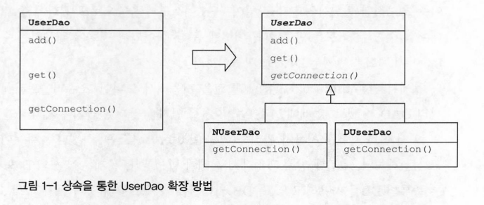

#

### 1.2.3 DB 커넥션 만들기의 독립

#### 상속을 통한 확장

기존 UserDao 코드 한번 더 분리
기존 UserDao 메소드의 구현 코드 제거 후 getConnection()을 추상 메소드로 변경
추상 메소드라 메소드 코드 존재 x 그러나 메소드 자체는 존재
add()와 get() 메소드는 getConnection() 메소드를 호출 코드 유지 가능

N사와 D사에 추상클래스 UserDao 제공
UserDao를 상속 받아 NUserDao와 DUserDao 서브 클래스 만듬
서브 클래스에 UserDaodo의 추상 메소드 getConnection() 메소드 원하는대로 구현 가능



```java
public abstract class UserDao {
    public void add(User user) throws ClassNotFoundException, SQLException {
        Connection c = getConnection();
        //...
    }
    public User get(String id) throws ClassNotFoundException, SQLException {
        Connection c = getConnection();
        //...
    }
    public abstract Connection getConnection() throws ClassNotFoundException, SQLException;
}
public class NUserDao extends UserDao {
    public Connection getConnection() throws ClassNotFoundException, SQLException {
        // N사 DB 커넥션 코드
    }
}
public class DUserDao extends UserDao {
    public Connection getConnection() throws ClassNotFoundException, SQLException {
        // D사 DB 커넥션 코드
    }
}
```
템플릿 메소드 패턴(Template Method Pattern)
    슈퍼 클래스에 기본 로직 흐름 만들고 추상 메소드로 세부 구현을 서브 클래스에 맡기는 패턴
팩토리 메소드 패턴(Factory Method Pattern) 
    객체 생성의 인터페이스를 정의하지만 어떤 클래스의 인스턴스를 만들지는 서브 클래스에서 결정하는 패턴


